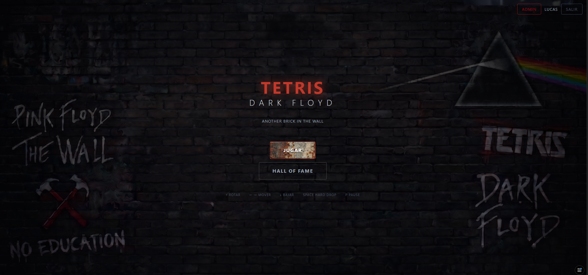
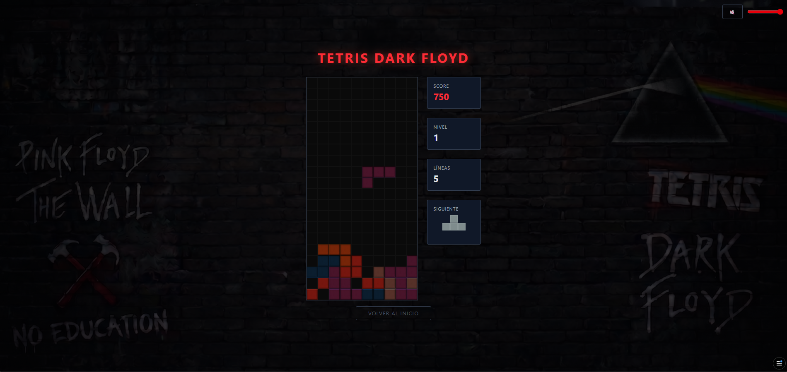
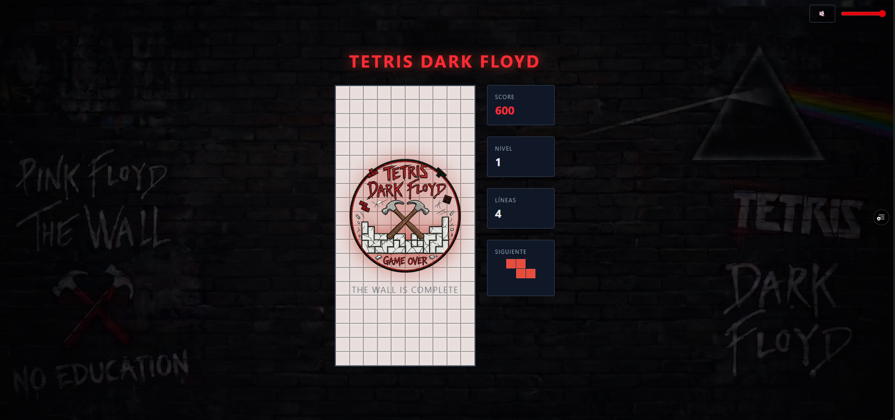
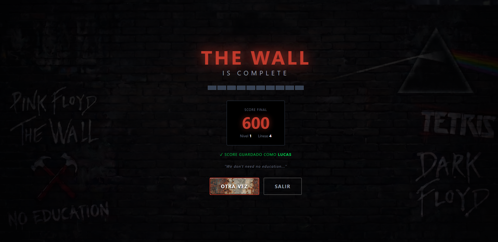
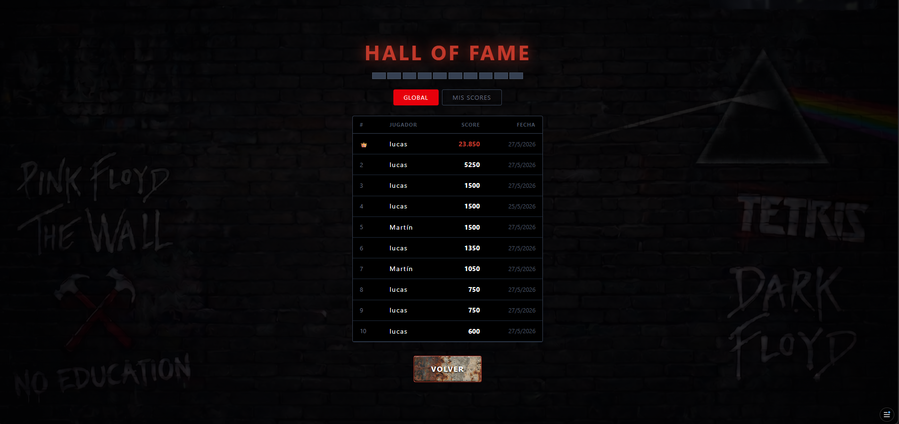
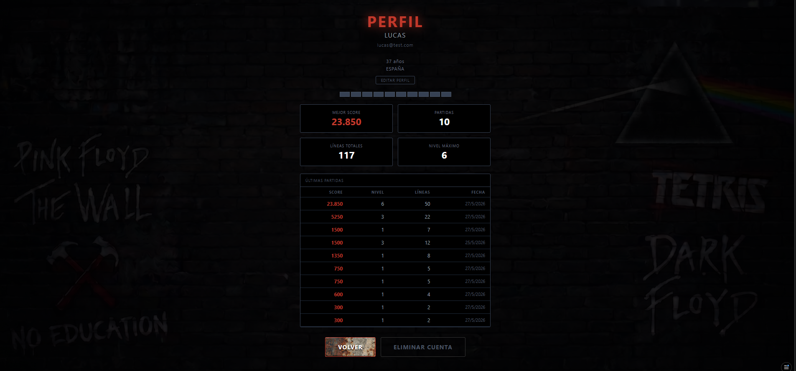
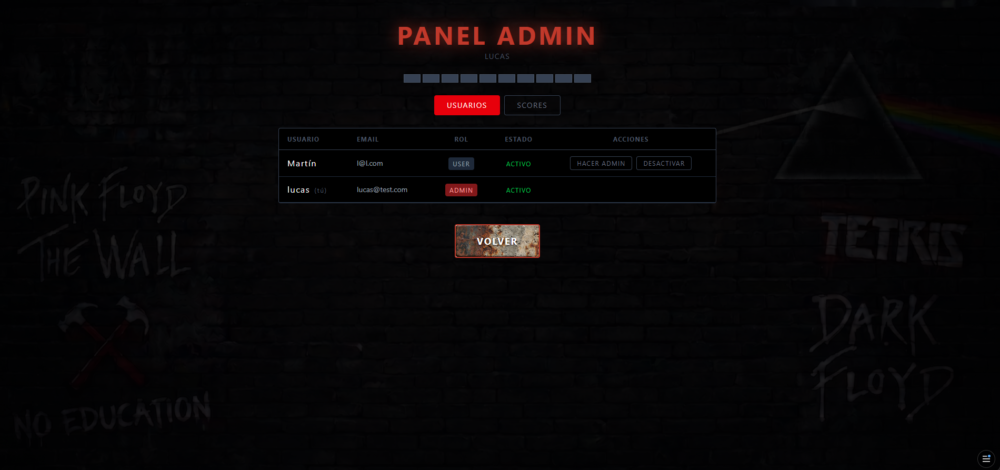
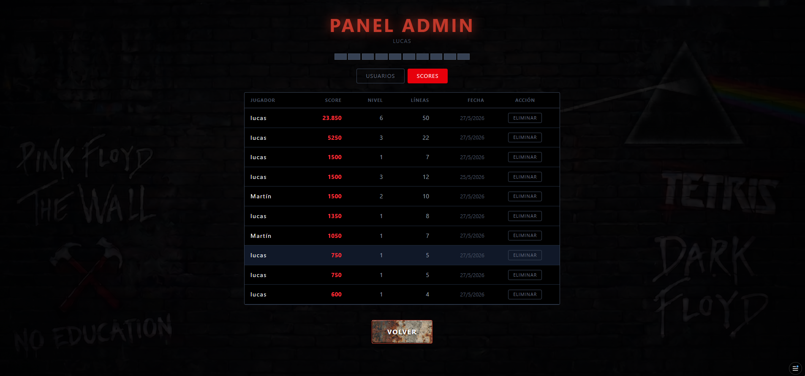

# 🎸 Tetris Dark Floyd

> *"We don't need no education..."*

A fully-featured Tetris game with a **Pink Floyd / The Wall** theme, built as a full-stack web application with React, Node.js, and MongoDB.

🎮 **[Play Now](https://tetris-dark-floyd.vercel.app/)**

---

## 📸 Screenshots

### Home Screen


### Gameplay


### The Wall is Complete



### Hall of Fame


### Player Profile


### Admin Panel



---

## 🚀 Features

### Gameplay
- Classic Tetris mechanics with 7 tetromino pieces
- Hard drop with spacebar
- Pause with P key
- Progressive speed increase by level
- Score multiplier based on lines cleared and level
- **Wall building animation** when the player loses — bricks fill the board from bottom to top, revealing The Wall

### Audio
- Pink Floyd background music during gameplay
- Sound effects on line clear and game over
- Volume control and mute button

### User System
- Register and login with JWT authentication
- Player profile with stats: best score, total games, total lines, max level
- Edit profile: username, age, country
- Full game history per user
- Delete account (scores are preserved)

### Hall of Fame
- Global leaderboard powered by MongoDB
- Personal score history for logged-in users

### Admin Panel
- View and manage all users
- Toggle user roles (user / admin)
- Activate and deactivate accounts
- Delete scores

---

## 🛠️ Tech Stack

### Frontend
- React 18 + Vite
- Tailwind CSS
- Axios
- Howler.js (audio)

### Backend
- Node.js + Express
- MongoDB + Mongoose
- JWT Authentication
- bcryptjs

### Infrastructure
- Frontend: [Vercel](https://vercel.com)
- Backend: [Fly.io](https://fly.io)
- Database: [MongoDB Atlas](https://www.mongodb.com/atlas)

---

## 📁 Project Structure

```
tetris-dark-floyd/
├── web/                     # React frontend
│   └── src/
│       ├── components/      # Game board, pieces, UI
│       ├── hooks/           # useGameLogic, useSound, useInterval
│       ├── pages/           # Home, Game, Scores, Profile, Admin
│       ├── context/         # Auth context
│       ├── services/        # API calls
│       ├── utils/           # Board and piece utilities
│       └── constants/       # Tetrominos, game config
└── api/                     # Node.js backend
    └── src/
        ├── controllers/     # Auth, users, scores
        ├── models/          # User, Score
        ├── routes/          # API routes
        ├── middleware/      # JWT auth
        └── config/          # Database connection
```


## 🔧 Local Development

### Prerequisites
- Node.js v18+
- MongoDB Atlas account

### Clone the repo
```bash
git clone https://github.com/lucasfajersztejn/tetris-dark-floyd.git
cd tetris-dark-floyd
```

### Install dependencies
```bash
# Install root dependencies
npm install

# Install frontend dependencies
cd web && npm install

# Install backend dependencies
cd ../api && npm install
```

### Environment variables

Create `api/.env`:

```
PORT=5000
MONGODB_URI=your_mongodb_uri
JWT_SECRET=your_jwt_secret
FRONTEND_URL=http://localhost:5173
```

### Run both servers
```bash
# From the root folder
npm run dev
```

Frontend runs on `http://localhost:5173`
Backend runs on `http://localhost:5000`

---

## 🎮 How to Play

| Key | Action |
|-----|--------|
| ← → | Move piece |
| ↑ | Rotate piece |
| ↓ | Soft drop |
| Space | Hard drop |
| P | Pause / Resume |

---

## 👤 Author

**Lucas Fajersztejn**
- GitHub: [@lucasfajersztejn](https://github.com/lucasfajersztejn)
- LinkedIn: [www.linkedin.com/in/lucas-fajersztejn](https://www.linkedin.com/in/lucas-fajersztejn/)

---

> Built with 🎸 and React